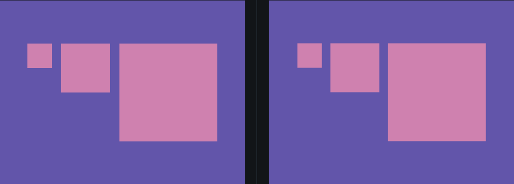

## RETOS DE CSS

En este repositorio se irán mostrando los distintos retos diarios de css que se publican en la web [css battle](https://cssbattle.dev/daily) con la finalidad de practicar las distintas propiedades de CSS de una manera sencilla y con la cantidad mínima de caracteres.

Cada solución contendrá un enlace al documento reto#.html y una imagen con el resultado obtenido y el resultado esperado.

### Día 12/12/2024

El reto de hoy consistía en crear 3 cuadrados de distintos tamaños y que se posicionen en el centro de una pantalla de 400 x 300 y se ubiquen en la posición superior del centro.

Aquí adjunto la solución que he generado:

[Solución](reto1.html)

